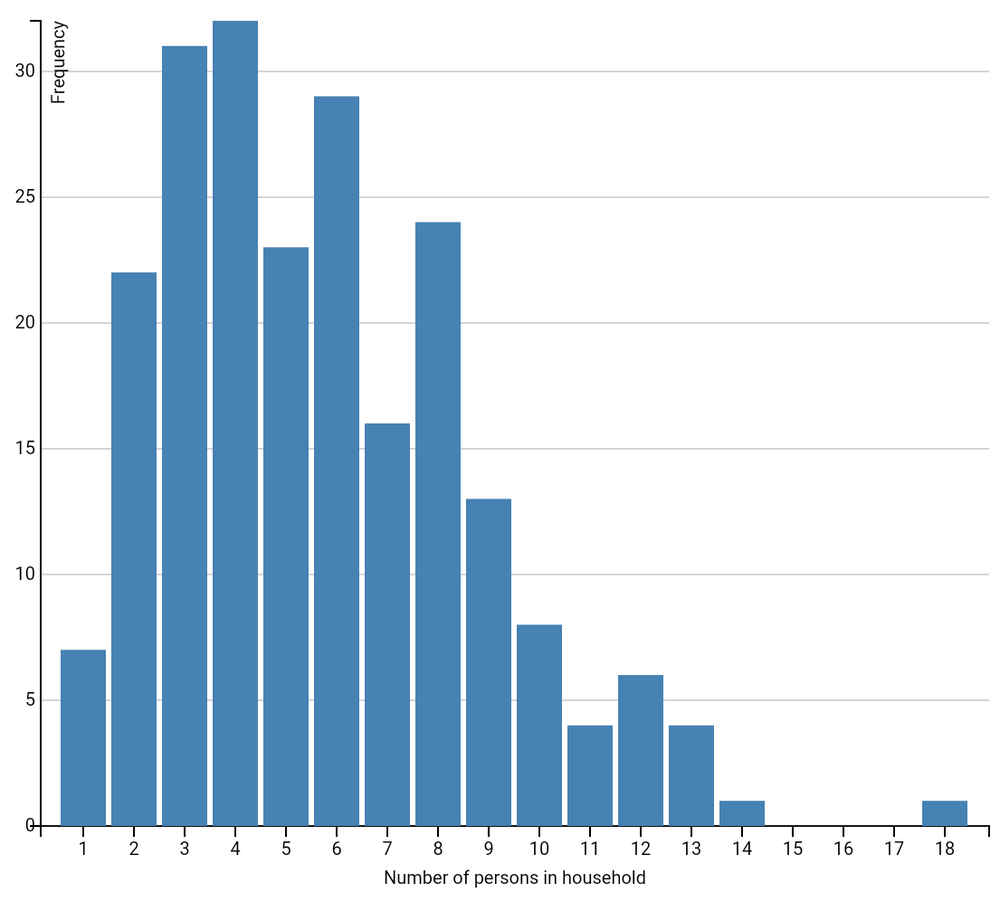
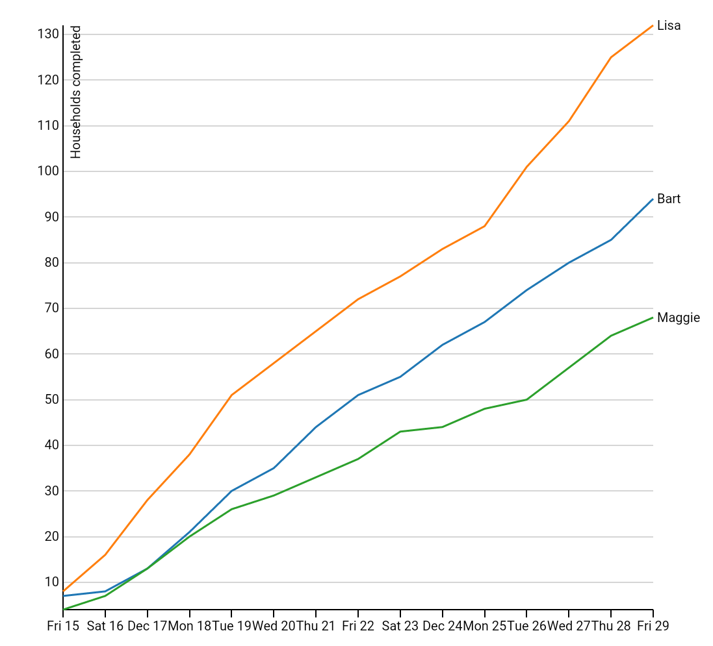
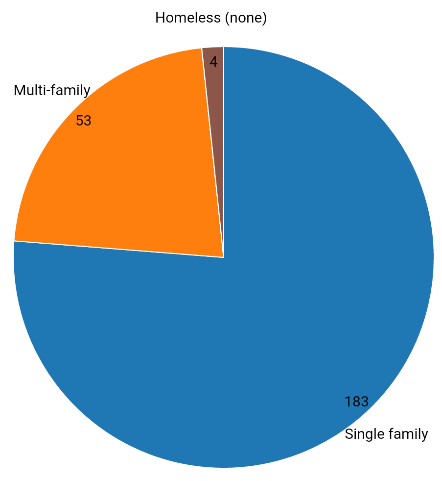
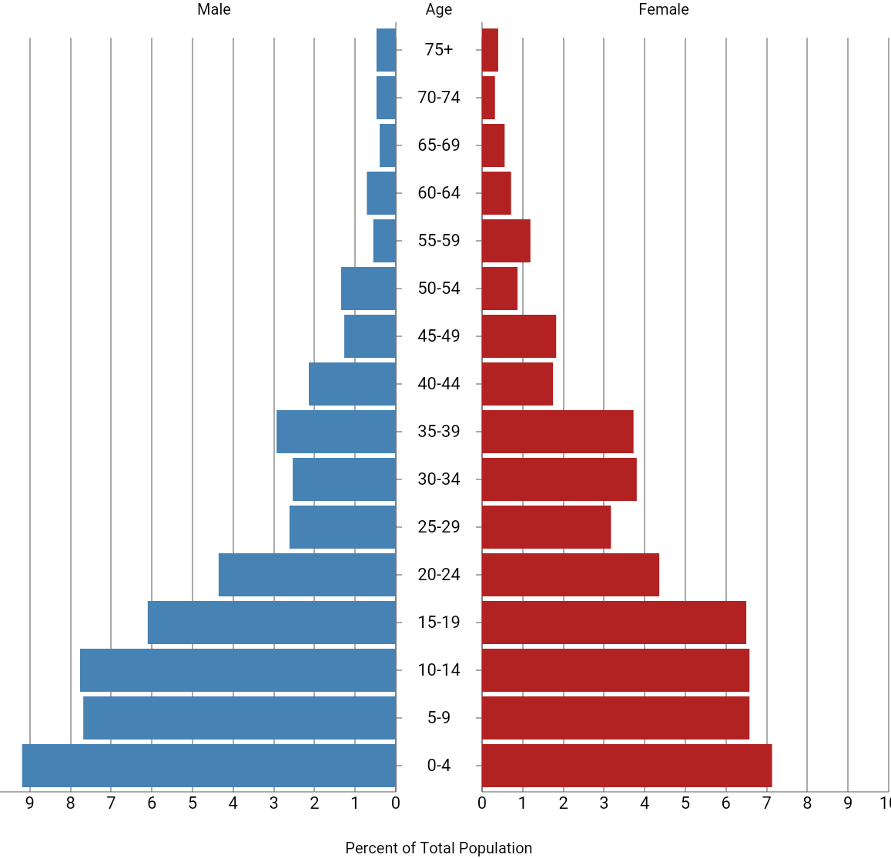
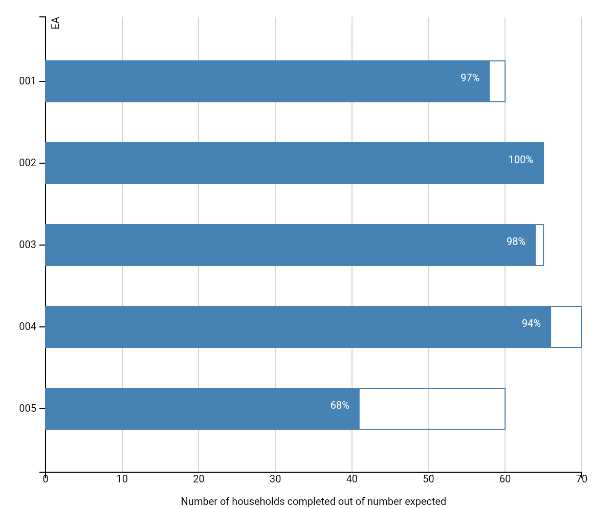

HTML/D3 Reports in CSPro
========================

Example of displaying charts from a CSPro data entry application using [D3](http://d3js.org/).
The CSPro data entry application calculates the data required for the chart and writes it out to a javascript file in JSON format. It then uses the [execsystem()](http://www.csprousers.org/help/html/execsystem_function_(android).htm) function to launch an HTML page containing code to generate the chart that uses a `<script>` tag to include the data file generated from CSPro.

All files needed for chart generation are included locally so no webserver is required to display the charts. It will run both on Windows and on Android devices without an internet connection.

Examples of the following charts are included:

* Bar chart: histogram of household sizes

* Line chart: completed interviews by day

* Pie chart: distribution of housing type

* Population pyramid: age/sex distribution

* Progress bar chart: housing units per enumeration area versus expected

The charts were created based on the D3 examples with the exception of the population pyramid which is a modified verision of a [jsbin by jshanley](http://jsbin.com/jalex/1/edit) (no relation).

The dataset used for the examples is a slightly modified subset of the Popstan example that comes with CSPro.

Requirements
------------
* [CSPro](http:/www.census.gov/population/international/software/cspro/) version 6.1 or above to build/run on Windows
* [CSEntry Android](https://play.google.com/store/apps/details?id=gov.census.cspro.csentry) to run on Android
